# FlaNKKS - Streaming Demo

**Status:** *Work in progress*

---

# Introduction

The purpose of this repo is to enable the easy and quick setup of a FLaNKKS demo use-case. We are using Flink, Nifi, Kafka, Kudu, and SQL Stream Builder as well as some other tools to showcase a streaming data use-case from edge to visualization.

The setup is very flexible and can be reused for different scenarios. Below is using a fleet control example. The main goal is a 10-20 minute **demo** to customers. The sensors can be renamed to suit the scenario and the geolocation data can also be updated/edited to fit to the location of the customer.

# Overview

Below is the demo flow including Nifi to collect the data simulating sensors at the edge. These could be on vehicles or wearables etc. We are then combining different datasources and enrich the data to display realtime streaming data on a map.

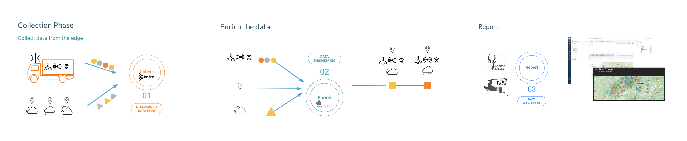


# Pre-requisites

Obtain a Cloudera download site user and password which comes with a license purchase or for partners a partner development license from Cloudera's partner portal. The partner development license is strickly for partners to develop and show integration of their products and solutions with Cloudera products.

We will be using the Edge2AI Workshop install for this demo [here](https://github.com/cloudera-labs/edge2ai-workshop/) to setup an 'edge2ai' one node CDP cluster. There are two installs people external to Cloudera can use described on that project;

a fully automated install on AWS infrastructure [here](https://github.com/cloudera-labs/edge2ai-workshop/tree/trunk/setup#running-locally-without-docker) for prereqs and [here](https://github.com/cloudera-labs/edge2ai-workshop/tree/trunk/setup#setup) for install steps.

or 
[install on an existing supported Linux VM](https://github.com/cloudera-labs/edge2ai-workshop/tree/trunk/setup#deploying-on-an-existing-vm).  If creating your own existing supported Linux VM you probably want the VM shape to be something like the AWS *r5a.4xlarge* (suggest 200GB+ root disk, 200GB+ additional disk volume not mounted, 128GB+ mem).  

Alternatively you can manaully install your own environment.  There is an example tutorial [here](https://www.cloudera.com/tutorials/how-to-create-a-cdp-private-cloud-base-development-cluster.html) that starts with a CDP Base installation. The install docs on the options describe their installs.

For the purpose of this doc, we will use the edge2ai workshop as the install basis.  If you followed the automated AWS edge2ai install path, that creates the CentOS 7 VM and installs CDP.  If you followed the path to install on an existing CentOS 7 VM that will install CDP on that existing VM.

The main edge2ai workshop github page provides a generic list of the CDP application links and some optional self training labs.   

The next steps for the automated AWS install are:
* Get IP from the ‘web’ instance and go to the web portal
* Login with the username/password as defined per setup
* Download ssh key from web portal and update permission

If you installed on your own VM:
* Note your VM IP and use the list of components on main workshop page [here](https://github.com/cloudera-labs/edge2ai-workshop/) substituting your IP and the ssh access to the VM you setup

The following steps can then be used for either of the install paths you followed.

# Step 1: Start the data stream

You have two choices below to create a sensor data stream; NiFi or command line.  The command line is probably easier.  The NiFi approach is more fun and demonstrates the stream data coming through a flow.

## Nifi approach for the sensor stream data(optional)

*You can use NiFi to create the sensor stream or connect via ssh and start a generator script via console.*

Download this NiFi template file and replace the 3 instances of 52.48.192.20 with your VM IP before loading nd starting in NiFi.  Alternatively you can import the template as is then update the IPs of your processors in the designer as well as the record reader and writer, to reflect your cluster's IP.  It's easier and quicker just to edit the file first.

[20220622_083349_Streaming-Demo_NiFi_Flow.xml](assets/20220622_083349_Streaming-Demo_NiFi_Flow.xml)

In NiFi, from the Operate Palette click on the Upload Template icon. Import the NiFi flow.

Then drag the top bar Template icon to your flow designer and you will be promted to select the template to add to your flow.

Your canvas should now look like below:

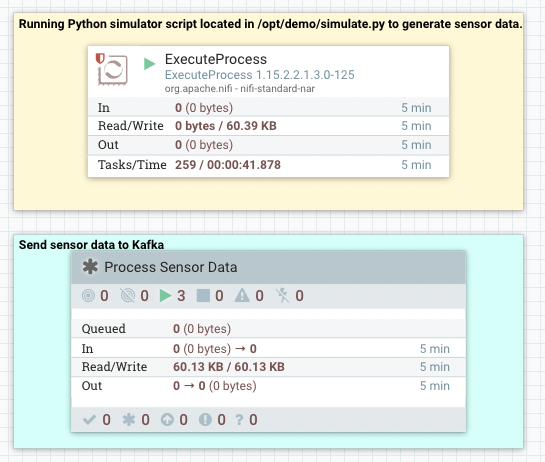

Go to the Schema Registry and follow lab 1 from [here](https://github.com/cloudera-labs/edge2ai-workshop/blob/trunk/workshop_nifi.adoc#lab-1---registering-a-schema-in-schema-registry) to add the Schema to the Registry.

You can find the schema text [here](https://raw.githubusercontent.com/cloudera-labs/edge2ai-workshop/master/sensor.avsc).

The result will look as follows:

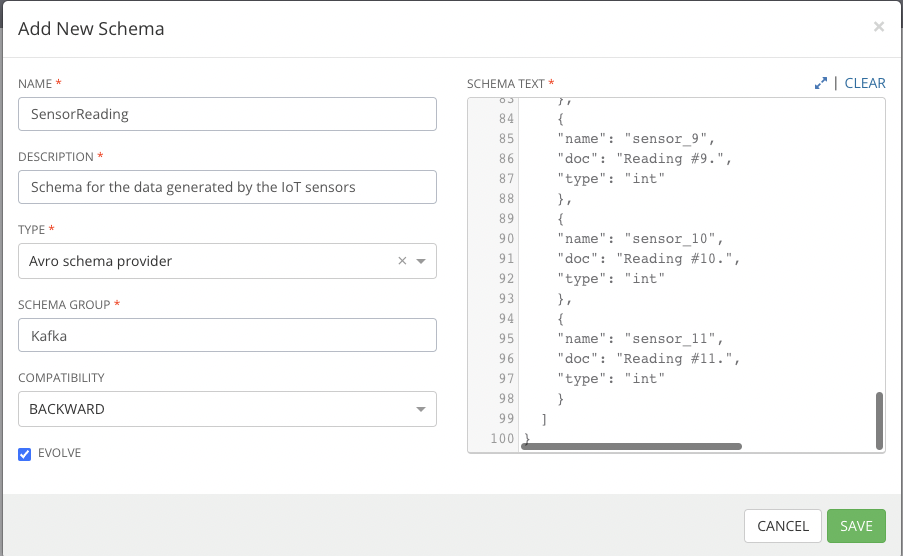

## Weather data

1. Download the jar's

```
ssh -i workshop.pem centos@IP

sudo wget https://github.com/zBrainiac/kafka-producer/releases/download/0.0.1/kafka-producer-0.0.1.0.jar -P /opt/cloudera/parcels/FLINK/lib/flink/examples/streaming
```

2. Start iot sensor stream (JSON) - (or use NiFi as described above)

```
cd /opt/cloudera/parcels/FLINK/lib/flink/examples/streaming &&

java -classpath kafka-producer-0.0.1.0.jar producer.KafkaIOTSensorSimulator edge2ai-0.dim.local:9092 1000
```

3. Start Weather data stream (CSV)

```
Open a new shell as above.
cd /opt/cloudera/parcels/FLINK/lib/flink/examples/streaming &&

java -classpath kafka-producer-0.0.1.0.jar producer.KafkaLookupWeatherCondition edge2ai-0.dim.local:9092
```

# Step 2: Create the Kudu Tables
Open Hue and select the Impala Editor 

http://<your_IP>:8889/

or

from CM, Select the Hue service, Hue UI, login as admin (first time Hue login sets a Hue admin user as prompted), then select the Impala editor.

1. Create *sensors*

```sql
DROP TABLE if exists sensors;
CREATE TABLE sensors (
sensor_id INT,
sensor_ts TIMESTAMP,
sensor_0 DOUBLE,
sensor_1 DOUBLE,
sensor_2 DOUBLE,
sensor_3 DOUBLE,
sensor_4 DOUBLE,
sensor_5 DOUBLE,
sensor_6 DOUBLE,
sensor_7 DOUBLE,
sensor_8 DOUBLE,
sensor_9 DOUBLE,
sensor_10 DOUBLE,
sensor_11 DOUBLE,
is_healthy INT,
PRIMARY KEY (sensor_ID, sensor_ts)
)
PARTITION BY HASH PARTITIONS 16
STORED AS KUDU
TBLPROPERTIES ('kudu.num_tablet_replicas' = '1');
```

2. Create *GeoLocation* data

```sql
DROP TABLE if exists RefData_GeoLocation;
CREATE TABLE if not exists RefData_GeoLocation (
sensor_id INT,
city STRING,
lat DOUBLE,
lon DOUBLE,
PRIMARY KEY (sensor_ID)
)
PARTITION BY HASH PARTITIONS 16
STORED AS KUDU
TBLPROPERTIES ('kudu.num_tablet_replicas' = '1');
```

3. Add your custom location data using this sql in the Impala Editor.

   [austria](assets/20220623_111410_austria.sql)

   [hungary](assets/20220623_111508_hungary.sql)

   [switzerland](assets/20220623_093403_switzerland.sql)
4. Create target table *sensors_joined*

   Update the column names to suit your example! Below are car/truck sensors.

```sql
DROP TABLE if exists sensors_joined ;
CREATE TABLE sensors_joined(
sensor_id BIGINT,
sensor_ts BIGINT,
liquid_level BIGINT,
airflow BIGINT,
temperature BIGINT,
humidity BIGINT,
speed BIGINT,
brake_wear BIGINT,
tire BIGINT,
AirTemperature2m STRING,
city STRING,
lat DOUBLE,
lon DOUBLE,
PRIMARY KEY (sensor_id, sensor_ts)
)
PARTITION BY HASH PARTITIONS 16
STORED AS KUDU
TBLPROPERTIES ('kudu.num_tablet_replicas' = '1');
```

# Step 3: Create virtual tables in SQL Stream Builder

http://<your_IP>:18121/

Open the SSB Console, create a job and run the following SQL.

1. Create Weather condition upsert

```sql

DROP TABLE IF EXISTS `weather_condition_upsert`;
CREATE TABLE `weather_condition_upsert` (
`stationid` INT,
`eventDate` BIGINT,
`tre200s0` STRING,
`rre150z0` STRING,
`sre000z0` STRING,
`gre000z0` STRING,
`ure200s0` STRING,
`tde200s0` STRING,
`dkl010z0` STRING,
`fu3010z0` STRING,
`fu3010z1` STRING,
`prestas0` STRING,
`pp0qffs0` STRING,
`pp0qnhs0` STRING,
`ppz850s0` STRING,
`ppz700s0` STRING,
`dv1towz0` STRING,
`fu3towz0` STRING,
`fu3towz1` STRING,
`ta1tows0` STRING,
`uretows0` STRING,
`tdetows0` STRING,
PRIMARY KEY (`stationid`) NOT ENFORCED
) WITH (
'connector' = 'upsert-kafka',
'topic' = 'kafka_LookupWeatherCondition',
'properties.bootstrap.servers' = 'edge2ai-0.dim.local:9092',
'properties.group.id' = 'kafka_LookupWeatherCondition_upsert',
'key.format' = 'raw',
'value.format' = 'csv'
);

```

2. Create *iot_enriched_source*

*Virtual Tables on SSB are a way to associate a Kafka topic with a schema so that we can use that as a table in our queries.*

---

We will use a Source Virtual Table now to read from the topic.

To create our Source Virtual Table, click on Console (on the left bar) > Tables > Add table > Apache Kafka.

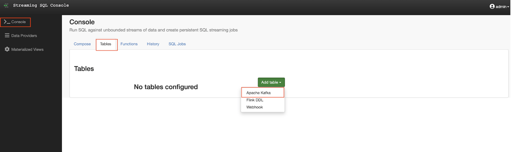

On the Kafka Source window, enter the following information:

Virtual table name: `iot_enriched_source`

Kafka Cluster:      `Local Kafka`

Topic Name:         `iot`

Data Format:        `JSON`

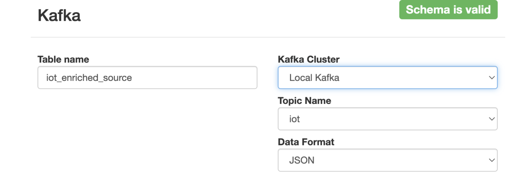


Ensure the Schema tab is selected. Scroll to the bottom of the tab and click Detect Schema. SSB will take a sample of the data flowing through the topic and will infer the schema used to parse the content. Alternatively you could also specify the schema in this tab.

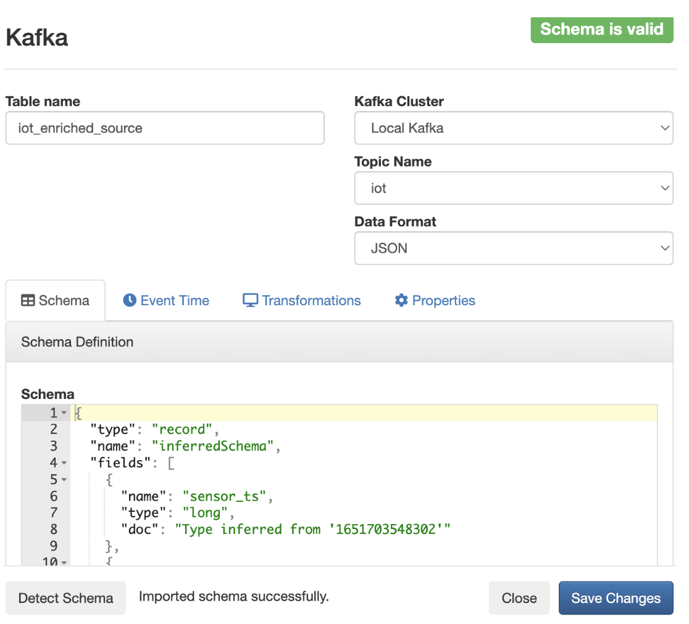

Click on the Event Time tab, define your time handling. You can specify Watermark Definitions when adding a Kafka table. Watermarks use an event time attribute and have a watermark strategy, and can be used for various time-based operations.
The Event Time tab provides the following properties to configure the event time field and watermark for the Kafka stream:

1. Input Timestamp Column: name of the timestamp column in the Kafka table from where the event time column is mapped. If you wanna use a column from the event message you have to unselect the box Use Kafka Timestamp first.
2. Event Time Column: new name of the timestamp column where the watermarks are going to be mapped

Watermark seconds : number of seconds used in the watermark strategy. The watermark is defined by the current event timestamp minus this value.

Input Timestamp Column: `sensor_ts`

Event Time Column:      `event_ts`

Watermark Seconds:      `3`

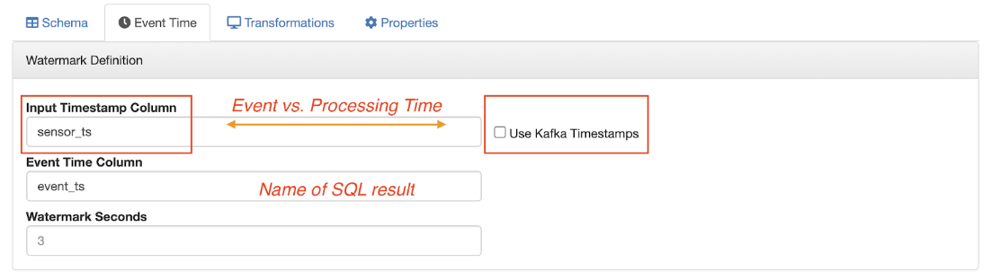

If we need to manipulate the source data to fix, cleanse or convert some values, we can define transformations for the data source to perform those changes. These transformations are defined in Javascript.
The serialized record read from Kafka is provided to the Javascript code in the record.value variable. The last command of the transformation must return the serialized content of the modified record.
The sensor_0 data in the iot topic has a pressure expressed in micro-pascal. Let’s say we need the value in pascal scale. Let’s write a transformation to perform that conversion for us at the source.
Click on the Transformations tab and enter the following code in the Code field:

```javascript
// Kafka payload (record value JSON deserialize to JavaScript object)

var payload = JSON.parse(record.value);

payload['sensor_0'] = Math.round(payload.sensor_0 * 1000);

JSON.stringify(payload);
```

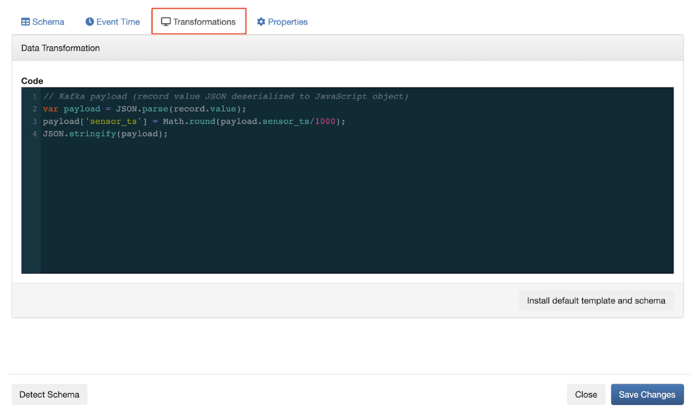

Click on the Properties tab, enter the following value for the Consumer Group property and click Save changes.

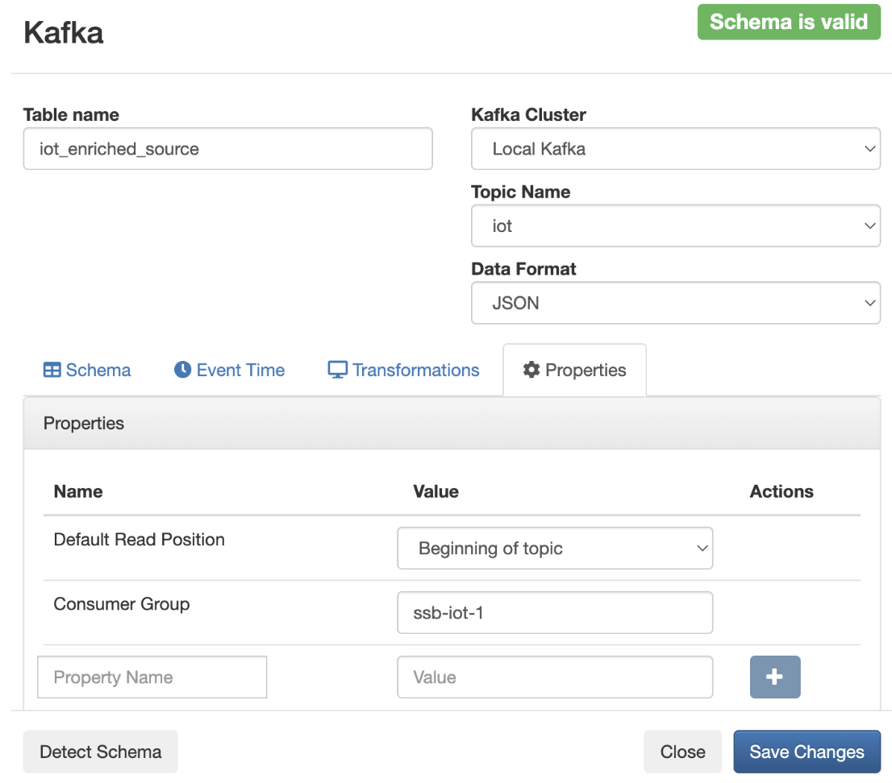

Setting the Consumer Group properties for a virtual table will ensure that if you stop a query and restart it later, the second query execute will continue to read the data from the point where the first query stopped, without skipping data. However, if multiple queries use the same virtual table, setting this property will effectively distribute the data across the queries so that each record is only read by a single query. If you want to share a virtual table with multiple distinct queries, ensure that the Consumer Group property is unset.

3. Add Kudu as Data Catalog in SBB

Click on Data Providers and +Register Catalog.

Name: `kudu_source`

Catalog Type: `kudu`

Kudu Masters: `<your_IP>:7051`

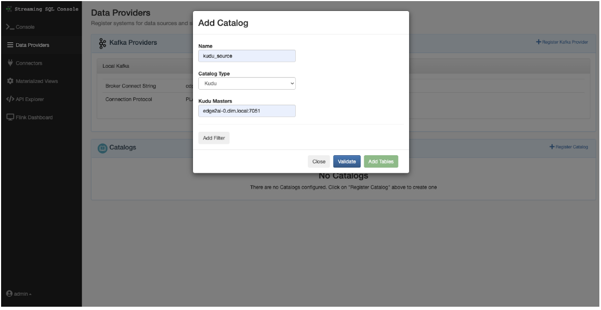

Then click ‘**validate**’ and ‘**Add Table**’ (or ‘**Create**’ depending on SSB version) and then go back to the **Console > SQL**.

Make sure to add the EXACT same column names as in step 2.4!

```sql
INSERT INTO `kudu_source`.`default_database`.`default.sensors_joined`
SELECT
iot.`sensor_id`,
iot.`sensor_ts`,
iot.`sensor_0` as liquid_level,
iot.`sensor_1` as airflow,
iot.`sensor_2` as temperature,
iot.`sensor_3` as humidity,
iot.`sensor_4` as speed,
iot.`sensor_5` as brake_wear,
iot.`sensor_6` as tire,
Replace(weather.`tre200s0`, '''', '') as AirTemperature2m,
Replace(geo.city, '''', ''),
geo.`lat`,
geo.`lon`
FROM iot_enriched_source AS iot
JOIN  weather_condition_upsert AS weather
ON iot.`sensor_id` = weather.`stationid`
LEFT JOIN `kudu_source`.`default_database`.`default.refdata_geolocation` AS geo
ON iot.`sensor_id` = geo.`sensor_id`;
```

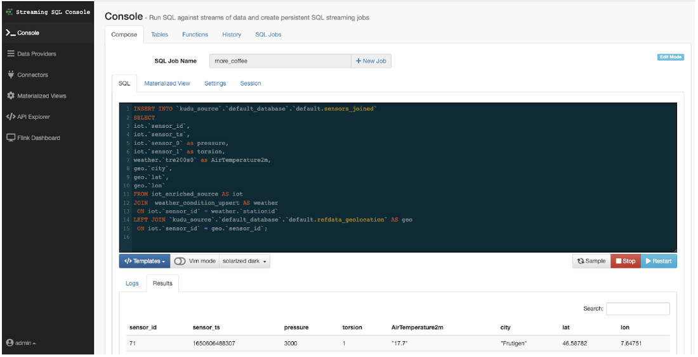

Execute.  The job will start.  Make sure there are no errors.

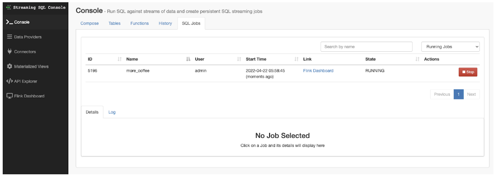

Open the Flink dashboard and verify that the job is running.

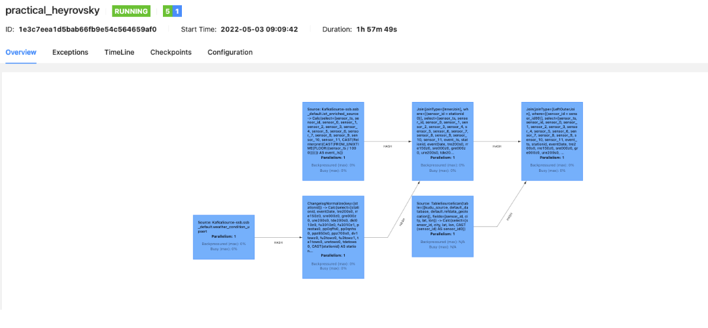

# Step 4: Show the results on a map

Go to Data Viz via the webinterface of the web instance and click on ‘data’ to add a new connection.

http://viz.cdsw.<your_IP>.nip.io/

1. Add new Data Connection

Basic:

Connection type: `Impala`

Connection name: `ssb_1`

Hostname or IP address: `YOUR HOST IP ADDRESS`

Advanced:

Connection mode: `Binary`

Socket type: `Normal`

Authentication mode: `NoSasl`

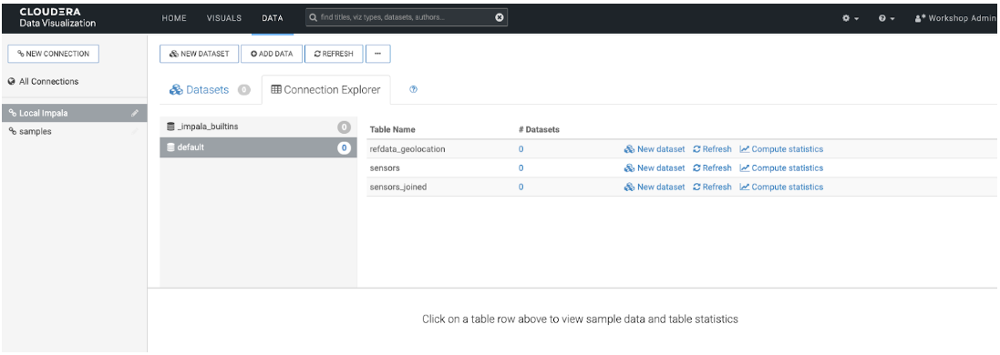

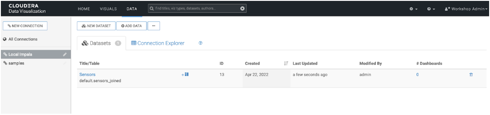

We are going to use google maps with our joined senor and location data.  You need to get a Google API Id we will use in this step.  Do a web search on google map API key and follow the isntructions to get a google maps API key.

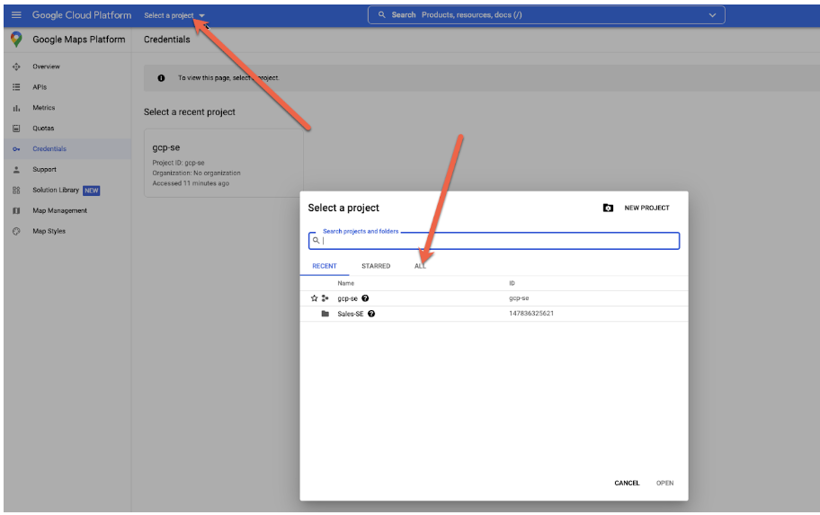

Then add the key in DataViz under **Site Settings > Google API Id** and save the settings.

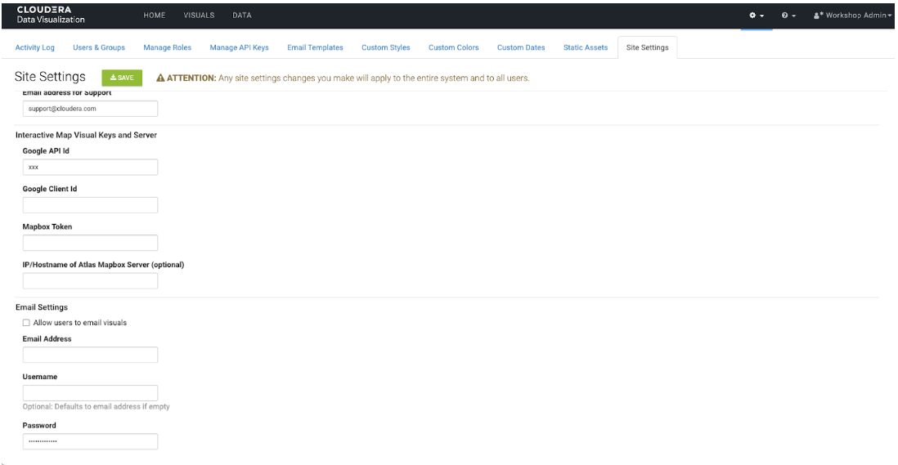

You can now either create the map yourself or import a ready made dashboard:

[Import Fleet Control Dashboard](assets/20220623_092822_visuals_fleet-control.json)

Import the Dashboard by clicking on the ... under **Data** and then click on **Import Visual Artifacts**.

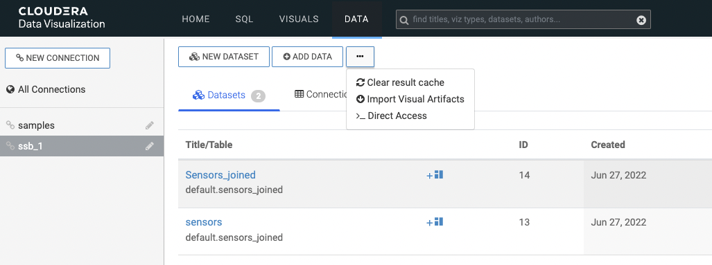

Below is an example of what it will look like:

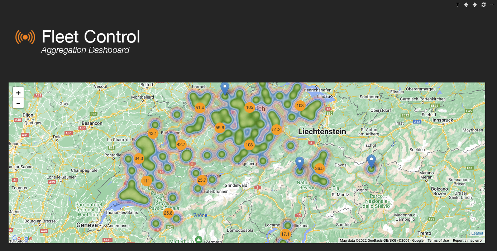

Resources
Original blog by Regina Hackenburg


Cloudera Documentation
